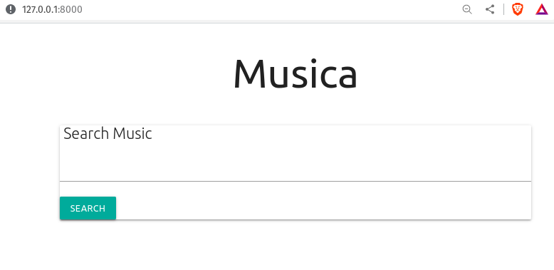
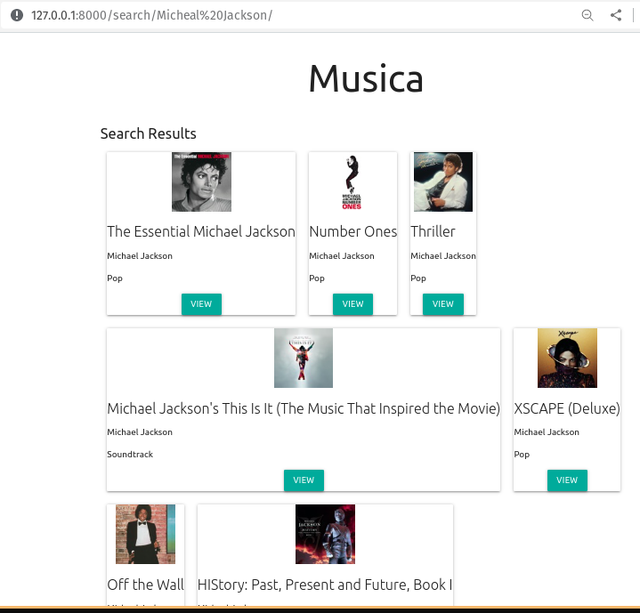

# musica

Search music from iTunes API and display results

- **Github repository**: <https://github.com/udaycruise2903/musica/>
- **Documentation** <https://udaycruise2903.github.io/musica/>

### Screenshots

### URLs

Homepage          - 127.0.0.1:8000/
Search results    - 127.0.0.1:8000/search/query/